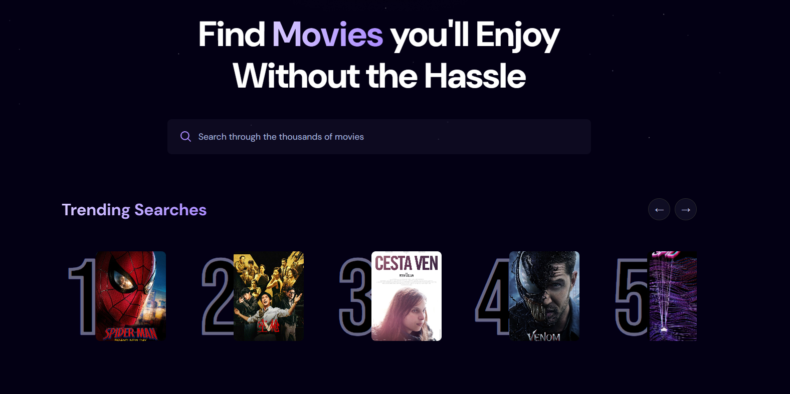

# [Movies App](https://movie-3ufh9jdtu-ahmed-hegazy-h-projects.vercel.app/)

 <h1>Movie Discovery & Analytics Web App </h1>
 &nbsp;&nbsp;
  
  
  
    

  <!-- Tech Stack Grid with Names Underneath -->
  <table align="center" style="border: none; border-collapse: collapse;">
    <tr style="border: none;">
      <!-- React -->
      <td align="center" style="border: none; padding: 0 20px;">
         
        React.js
      </td>
      <!-- Three.js -->
      <td align="center" style="border: none; padding: 0 20px;">
         
        Appwrite
      </td>
      <!-- Tailwind CSS -->
      <td align="center" style="border: none; padding: 0 20px;">
         
        Tailwind CSS
      </td>
    </tr>
  </table>

    

  <!-- Fixed Action Links using your live link -->
  <a href="https://movie-3ufh9jdtu-ahmed-hegazy-h-projects.vercel.app/" target="_blank">
   Live Demo 👆
  </a>
  

---

### Project Overview

* **Built a scalable web app using TypeScript that aggregates real-time movie data and features a multi-metric search system.
* **Engineered a search-tracking popularity algorithm on the backend using Appwrite to dynamically rank and display trending movies. 
* **Styled a fluid, mobile-first interface using Tailwind CSS ensuring rapid loading times and seamless responsiveness across devices.
